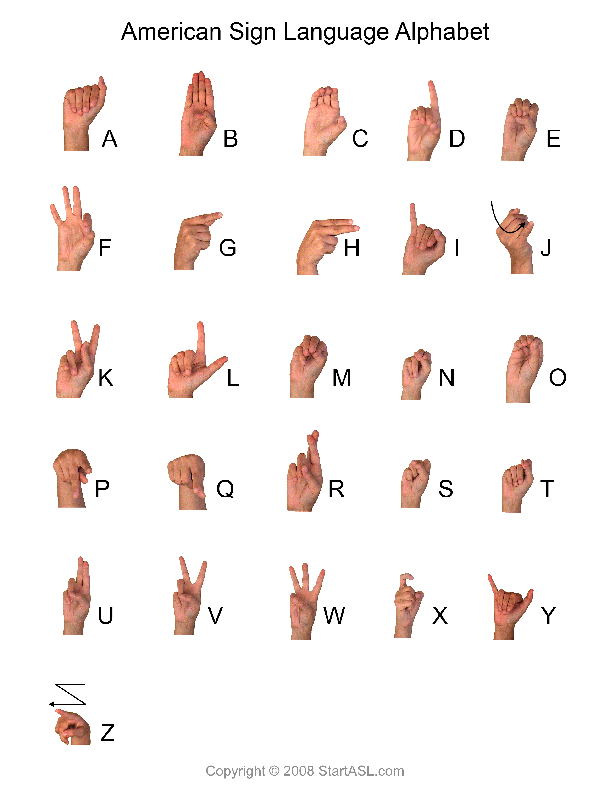

# Sign Language Detection

This is a Sign language detection model that can accurately recognize and interpret the gestures and movements of hands used in **American Sign Language (ASL)**.

The model processes real-time video data and provide real-time feedback on the signs being performed. The end goal of this project is to create a tool that can help bridge communication gaps between deaf and hearing individuals, and enable more inclusive and accessible interactions in various settings.

The image shows signs of the alphabets in ASL.

## Get Started

You can run this model on your system by installing a couple of things --
- [Python](https://www.python.org/downloads/)
- [Mediapipe](https://developers.google.com/mediapipe/framework/getting_started/install)
- Python libraries and modules like OpenCV, Time and OS
You can get started by checking out any of the setup guides for their installation. However, links of official sites and guides have been attached. 

## Framework:

### Mediapipe : 

MediaPipe is an open-source framework developed by Google that provides a set of pre-built, customizable building blocks for building multimodal machine learning pipelines. MediaPipe is built on top of TensorFlow, a popular open-source machine learning framework. 

 MediaPipe can be used to develop applications for a wide range of multimedia processing tasks, including audio and video processing, gesture recognition, object detection, and augmented reality. In this project, we used the pre-built hand tracking model of medipipe to develop our system. 

For more about Mediapipe, you can visit the official site of [Mediapipe](https://developers.google.com/mediapipe) or [linked Github repository](https://github.com/google/mediapipe).

----

## Working of the project:

### 1.Input data:

The module takes in video or image data as input, which contains one or more hands to
be tracked. 

### 2.Pre-processing:

The input data is pre-processed to prepare it for analysis. This may involve resizing,
normalization, or any other required data transformations. 

### 3.Architecture

The hand landmarker model bundle contains a palm detection model and a hand landmarks detection model. 

### 4.Hand detection: 

The first step in hand tracking is to detect the presence of a hand in the input data. The imported module (mediapipe) uses a machine learning model to detect the hand in each frame of the video or image. The Palm detection model locates hands within the input image, and the hand landmarks detection model identifies specific hand landmarks on the cropped hand image defined by the palm detection model. 

### 5.Hand landmark estimation: 

Once a hand has been detected, the MediaPipe Hand Tracking module uses another machine learning model to estimate the positions of 21 landmarks on the hand, such as the fingertips, knuckles, and wrist. 

### 6.Hand tracking:

The estimated hand landmarks are then tracked across frames of the video or image data to determine the hand's movements and gestures. 

### 7.Post-processing: 

Once the hand has been tracked, the output data is post-processed to make it easier to understand or use. In our code we have returned a list of tuples of id no. , x ,y and z coordinated of each of the 21 landmarks for further use in sign detection.

### 8.Output visualization: 

Finally, the results of the hand tracking analysis are visualized as text on the user’s screen. 

## System Requirements

-The operating system should be compatible with the MediaPipe framework and
any additional software or libraries used in the application.
-The processor should have sufficient processing power to handle real-time video
data and machine learning computations.
-A camera with at least 720p resolution and 30 frames per second (fps) is
recommended for capturing video data.

However, the model uses Mediapipe framework which is a lighweight framework and can be used for mobile ml solutions.

## Contributars

- [Gurkirat Singh](https://github.com/gurkirat20)
- Astha Singh
